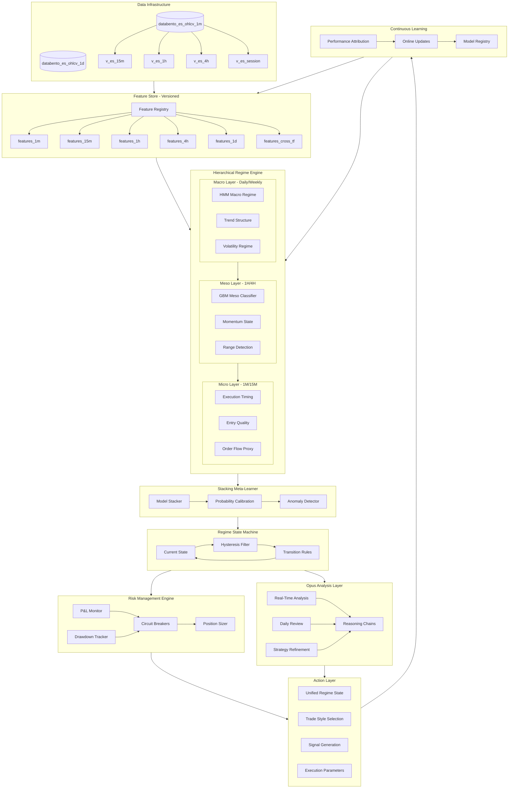
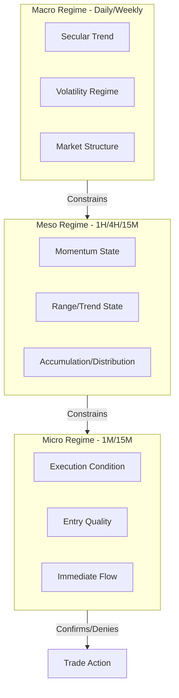
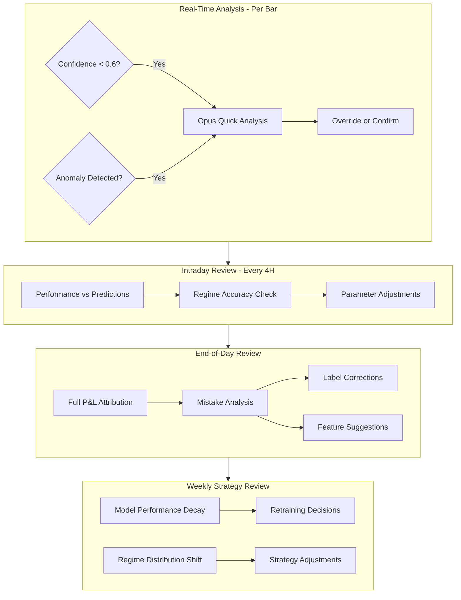
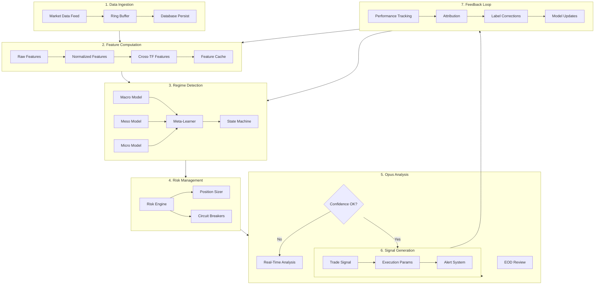

# ES Regime Detection System - Professional Grade Architecture

## Executive Summary

This system implements institutional-grade regime detection using a **hierarchical state machine** approach across five timeframes (1m, 15m, 1h, 4h, 1d). Unlike simple classifier approaches, we use:

- **Hierarchical regimes**: Macro context constrains meso, meso constrains micro
- **State machine with hysteresis**: Prevents flip-flopping, requires confirmation for transitions
- **Online learning**: Models adapt to regime drift without full retraining
- **Anomaly detection**: Knows when to say "I don't know"
- **Opus-in-the-loop**: AI review for edge cases and continuous improvement

---

## System Architecture - Professional Grade



---

## Phase 1: Data Infrastructure Enhancement

### 1.1 Add 15-Minute Aggregation

First, create the missing 15m view in `databento_es_ohlcv_1m`:

```sql
CREATE OR REPLACE VIEW databento_es_ohlcv_1m.v_es_15m AS
SELECT 
    date_trunc('hour', timestamp_utc) + 
        (FLOOR(EXTRACT(MINUTE FROM timestamp_utc) / 15) * INTERVAL '15 minutes') as timestamp_utc,
    date_utc,
    (array_agg(open ORDER BY timestamp_utc))[1] as open,
    MAX(high) as high,
    MIN(low) as low,
    (array_agg(close ORDER BY timestamp_utc DESC))[1] as close,
    SUM(volume) as volume,
    contract,
    session,
    COUNT(*) as bar_count
FROM databento_es_ohlcv_1m.es_continuous_1m
GROUP BY date_trunc('hour', timestamp_utc) + 
         (FLOOR(EXTRACT(MINUTE FROM timestamp_utc) / 15) * INTERVAL '15 minutes'),
         date_utc, contract, session
ORDER BY timestamp_utc;
```

### 1.2 Timeframe Hierarchy

| Timeframe | Role | Features Focus | Update Frequency |
|-----------|------|----------------|------------------|
| **1D** | Macro context | Trend structure, vol regime | Daily 21:00 UTC |
| **4H** | Strategic bias | Momentum, range detection | Every 4 hours |
| **1H** | Tactical direction | Entry zones, S/R levels | Hourly |
| **15M** | Swing timing | Pullback entries, confirmations | Every 15 min |
| **1M** | Execution | Entry/exit precision, microstructure | Real-time |

---

## Phase 2: Feature Store Architecture

### 2.1 Schema Design with Versioning

```sql
CREATE SCHEMA es_feature_store;

-- Feature registry: tracks all features with metadata
CREATE TABLE es_feature_store._feature_registry (
    feature_id SERIAL PRIMARY KEY,
    feature_name VARCHAR(100) UNIQUE NOT NULL,
    feature_group VARCHAR(50) NOT NULL,  -- trend, volatility, volume, micro, calendar, cross_tf
    timeframe VARCHAR(10) NOT NULL,       -- 1m, 15m, 1h, 4h, 1d
    computation_sql TEXT,
    dependencies JSONB,                   -- list of source features/tables
    importance_score NUMERIC(5,4),        -- from model training
    drift_threshold NUMERIC(5,4),
    created_at TIMESTAMP DEFAULT NOW(),
    is_active BOOLEAN DEFAULT TRUE
);

-- Feature store: point-in-time feature values
CREATE TABLE es_feature_store.features_1d (
    id BIGSERIAL PRIMARY KEY,
    date_utc DATE NOT NULL,
    feature_version INT DEFAULT 1,
    computed_at TIMESTAMP DEFAULT NOW(),
    
    -- Trend features (20+)
    ret_1d NUMERIC(10,6),
    ret_5d NUMERIC(10,6),
    ret_21d NUMERIC(10,6),
    ret_63d NUMERIC(10,6),
    ema_8_dist NUMERIC(10,6),
    ema_21_dist NUMERIC(10,6),
    ema_50_dist NUMERIC(10,6),
    ema_200_dist NUMERIC(10,6),
    adx_14 NUMERIC(10,4),
    adx_slope_5 NUMERIC(10,6),
    linreg_slope_20 NUMERIC(10,6),
    linreg_r2_20 NUMERIC(10,6),
    higher_high BOOLEAN,
    higher_low BOOLEAN,
    trend_strength NUMERIC(10,4),  -- composite score
    
    -- Volatility features (15+)
    vol_close_5d NUMERIC(10,6),
    vol_close_21d NUMERIC(10,6),
    vol_parkinson_5d NUMERIC(10,6),
    vol_garman_klass_5d NUMERIC(10,6),
    vol_yang_zhang_5d NUMERIC(10,6),
    atr_14 NUMERIC(10,4),
    atr_ratio_14_50 NUMERIC(10,4),
    vol_percentile_252 NUMERIC(5,2),
    vol_regime VARCHAR(10),  -- low, normal, high, extreme
    vol_expansion BOOLEAN,
    
    -- Volume features (10+)
    volume_sma_20_ratio NUMERIC(10,4),
    volume_trend_5d NUMERIC(10,6),
    accumulation_dist_21d NUMERIC(10,6),
    
    -- Structure features (10+)
    dist_from_20d_high NUMERIC(10,4),
    dist_from_20d_low NUMERIC(10,4),
    atr_from_20d_high NUMERIC(10,4),
    range_percentile_20d NUMERIC(5,2),
    inside_day BOOLEAN,
    outside_day BOOLEAN,
    
    -- Calendar features
    day_of_week INT,
    days_to_roll INT,
    is_fomc_week BOOLEAN,
    is_opex_week BOOLEAN,
    
    CONSTRAINT features_1d_date_version UNIQUE (date_utc, feature_version)
);

-- Similar tables for 1m, 15m, 1h, 4h with appropriate features
```

### 2.2 Feature Categories by Timeframe

**Macro Features (1D) - Strategic Context**

```python
MACRO_FEATURES = {
    'trend': [
        'ret_1d', 'ret_5d', 'ret_21d', 'ret_63d',
        'ema_distances', 'adx', 'linreg_slope', 'trend_strength'
    ],
    'volatility': [
        'realized_vol_5d', 'realized_vol_21d', 
        'vol_percentile', 'vol_regime', 'vol_trend'
    ],
    'structure': [
        'dist_from_high_low', 'swing_structure', 
        'weekly_bias', 'monthly_bias'
    ]
}
```

**Meso Features (1H/4H) - Tactical Direction**

```python
MESO_FEATURES = {
    'momentum': [
        'rsi_14', 'rsi_divergence', 'macd_histogram',
        'momentum_percentile', 'thrust_indicator'
    ],
    'range': [
        'bollinger_position', 'keltner_position',
        'range_bound_score', 'breakout_probability'
    ],
    'alignment': [
        'trend_alignment_1h_4h', 'trend_alignment_4h_1d',
        'vol_alignment', 'momentum_alignment'
    ]
}
```

**Micro Features (1M/15M) - Execution Timing**

```python
MICRO_FEATURES = {
    'microstructure': [
        'bar_range_vs_avg', 'consecutive_direction',
        'inside_bar_count', 'volume_spike_score'
    ],
    'order_flow_proxy': [
        'delta_proxy', 'absorption_score',
        'initiative_vs_responsive', 'tick_direction_ratio'
    ],
    'entry_quality': [
        'pullback_depth', 'consolidation_tightness',
        'breakout_strength', 'retest_quality'
    ],
    'time_of_day': [
        'session_phase', 'time_to_session_end',
        'relative_volume_tod', 'volatility_tod_ratio'
    ]
}
```

**Cross-Timeframe Features (Alignment)**

```python
CROSS_TF_FEATURES = {
    'trend_alignment': {
        '1m_15m': 'micro_meso_trend_agreement',
        '15m_1h': 'meso_alignment_15m_1h',
        '1h_4h': 'meso_alignment_1h_4h', 
        '4h_1d': 'meso_macro_alignment',
        'full_stack': 'all_timeframe_agreement_score'
    },
    'volatility_alignment': {
        'vol_expansion_cascade': 'vol_expanding_across_tfs',
        'vol_regime_consistency': 'same_vol_regime_across_tfs'
    },
    'momentum_alignment': {
        'momentum_confirmation': 'momentum_agrees_across_tfs',
        'divergence_detection': 'higher_tf_divergence_flag'
    }
}
```

### 2.3 Feature Engineering Implementation

Location: `databento/features/`

```
features/
├── __init__.py
├── config/
│   ├── feature_definitions.yaml    -- All feature specifications
│   ├── feature_params.yaml         -- Lookback periods, thresholds
│   └── timeframe_config.yaml       -- TF-specific settings
├── core/
│   ├── feature_engine.py           -- Main computation orchestrator
│   ├── feature_store.py            -- Database read/write
│   ├── feature_registry.py         -- Feature metadata management
│   └── feature_validator.py        -- Data quality checks
├── calculators/
│   ├── trend_features.py           -- Trend calculations
│   ├── volatility_features.py      -- Vol calculations
│   ├── volume_features.py          -- Volume calculations
│   ├── microstructure_features.py  -- Micro calculations
│   ├── calendar_features.py        -- Calendar calculations
│   └── cross_tf_features.py        -- Cross-TF alignment
├── realtime/
│   ├── streaming_engine.py         -- Real-time feature updates
│   ├── feature_cache.py            -- In-memory feature cache
│   └── latency_monitor.py          -- Performance tracking
└── backfill/
    ├── historical_compute.py       -- Batch historical computation
    └── point_in_time.py            -- Ensure no lookahead bias
```

---

## Phase 3: Hierarchical Regime Detection

### 3.1 Three-Layer Regime Hierarchy

The key insight: **regimes exist at different timescales and must be detected hierarchically**.



### 3.2 Macro Regimes (1D timeframe)

Detected via **Gaussian HMM** on daily features. Sets the strategic context.

| Macro State | Characteristics | Constraint on Meso |
|-------------|-----------------|-------------------|
| **Bullish Trend** | ADX>25, price>EMA50, HH/HL | Only long meso trades |
| **Bearish Trend** | ADX>25, price<EMA50, LH/LL | Only short meso trades |
| **Expansion** | Vol percentile>80, range expanding | Wide stops, reduced size |
| **Contraction** | Vol percentile<20, range narrowing | Tight stops, await breakout |
| **Rotation** | Choppy, no clear structure | Reduce trading frequency |

**HMM Configuration:**

```python
MACRO_HMM_CONFIG = {
    'n_states': 5,
    'features': [
        'ret_21d', 'vol_percentile_252', 'adx_14',
        'trend_strength', 'range_percentile_20d'
    ],
    'covariance_type': 'full',
    'n_iter': 100,
    'min_regime_duration': 5,  # days
}
```

### 3.3 Meso Regimes (1H/4H/15M timeframes)

Detected via **Gradient Boosting Classifier** conditioned on macro state.

| Meso State | Detection Logic | Trading Implication |
|------------|-----------------|---------------------|
| **Strong Trend** | RSI trending, MACD expanding, vol rising | Swing with trend, trail stops |
| **Weak Trend** | RSI diverging, MACD contracting | Reduce size, tighten stops |
| **Range High** | Price at Bollinger/Keltner upper | Scalp short or wait |
| **Range Low** | Price at Bollinger/Keltner lower | Scalp long or wait |
| **Breakout** | Range squeeze releasing, volume surge | Enter on retest |
| **Chop** | ADX<20, whipsaws, failed breaks | **Sit out** |
| **Exhaustion** | Climactic volume, extreme extension | Counter-trend scalp only |

**Classifier Architecture:**

```python
MESO_CLASSIFIER_CONFIG = {
    'model': 'LightGBM',
    'objective': 'multiclass',
    'num_class': 7,
    'features': MESO_FEATURES + MACRO_STATE_EMBEDDING,
    'hyperparams': {
        'num_leaves': 31,
        'max_depth': 6,
        'learning_rate': 0.05,
        'feature_fraction': 0.8,
        'bagging_fraction': 0.8,
        'bagging_freq': 5,
    },
    'calibration': 'isotonic',  # Probability calibration
}
```

### 3.4 Micro Regimes (1M/15M timeframes)

Detected via **rule-based + ML hybrid** for execution timing.

| Micro State | Detection | Action |
|-------------|-----------|--------|
| **Clean Entry** | Pullback to support, tight consolidation | Execute entry |
| **Noisy** | Wide bars, conflicting signals | Wait or reduce size |
| **Momentum Surge** | 3+ consecutive directional bars, vol spike | Chase only if aligned |
| **Reversal Setup** | Climax bar, absorption pattern | Counter-trend scalp |
| **Dead Zone** | Lunch hours, low volume | Avoid new entries |

### 3.5 Regime State Machine with Hysteresis

Prevents flip-flopping by requiring confirmation for transitions.

```python
class RegimeStateMachine:
    """
    State machine that manages regime transitions with hysteresis.
    Requires N consecutive signals before confirming a transition.
    """
    
    def __init__(self):
        self.current_macro = None
        self.current_meso = None
        self.current_micro = None
        
        # Hysteresis buffers
        self.macro_buffer = deque(maxlen=3)   # 3 days confirmation
        self.meso_buffer = deque(maxlen=4)    # 4 hours confirmation  
        self.micro_buffer = deque(maxlen=5)   # 5 bars confirmation
        
        # Transition rules
        self.allowed_transitions = {
            'bullish_trend': ['rotation', 'expansion'],
            'bearish_trend': ['rotation', 'expansion'],
            'rotation': ['bullish_trend', 'bearish_trend', 'contraction'],
            'contraction': ['expansion', 'bullish_trend', 'bearish_trend'],
            'expansion': ['contraction', 'bullish_trend', 'bearish_trend'],
        }
    
    def update(self, new_macro_signal, new_meso_signal, new_micro_signal):
        """Update state machine with new signals."""
        
        # Macro: require 3/3 agreement
        self.macro_buffer.append(new_macro_signal)
        if len(set(self.macro_buffer)) == 1 and len(self.macro_buffer) == 3:
            if self._is_valid_transition(self.current_macro, new_macro_signal):
                self.current_macro = new_macro_signal
        
        # Similar for meso (4/4) and micro (3/5)
        # ...
        
        return self.get_unified_state()
    
    def get_unified_state(self) -> RegimeState:
        """Combine all layers into unified state."""
        return RegimeState(
            macro=self.current_macro,
            meso=self.current_meso,
            micro=self.current_micro,
            confidence=self._compute_confidence(),
            trade_style=self._derive_trade_style(),
            position_sizing=self._derive_position_sizing(),
        )
```

### 3.6 Meta-Learner (Stacking Ensemble)

Combines outputs from all regime models into calibrated probabilities.

```python
META_LEARNER_CONFIG = {
    'architecture': 'stacking',
    'base_models': [
        'hmm_macro',           # HMM regime probabilities
        'lgbm_meso',           # LightGBM meso classifier
        'xgb_meso',            # XGBoost meso classifier (diversity)
        'vol_regime_model',    # Volatility regime predictor
        'transition_model',    # Regime transition predictor
    ],
    'meta_model': 'LogisticRegression',  # Calibrated probabilities
    'calibration': 'platt_scaling',
    'output': {
        'regime_probs': 'dict[regime, probability]',
        'confidence': 'float',  # Entropy-based
        'anomaly_score': 'float',  # From isolation forest
    }
}
```

### 3.7 Anomaly Detection

Detects unprecedented market states where models shouldn't be trusted.

```python
ANOMALY_DETECTOR_CONFIG = {
    'model': 'IsolationForest',
    'features': ALL_FEATURES,
    'contamination': 0.05,  # 5% expected anomalies
    'triggers': [
        'anomaly_score > 0.8',           # High anomaly score
        'vol_percentile > 99',            # Extreme volatility
        'regime_confidence < 0.3',        # Models disagree
        'feature_drift_detected',         # Distribution shift
    ],
    'action': 'FORCE_SIT_OUT',
}
```

### 3.8 Unified Regime State Output

```python
@dataclass
class RegimeState:
    # Hierarchical regime states
    macro_regime: str                    # "bullish_trend", "rotation", etc.
    macro_confidence: float              # 0-1
    meso_regime: str                     # "strong_trend", "range_high", etc.
    meso_confidence: float               # 0-1
    micro_regime: str                    # "clean_entry", "noisy", etc.
    micro_confidence: float              # 0-1
    
    # Volatility overlay
    volatility_regime: str               # "low", "normal", "high", "extreme"
    volatility_percentile: float         # 0-100
    
    # Transition probabilities
    regime_age_bars: int                 # How long in current regime
    transition_prob_1h: float            # P(regime change in 1 hour)
    transition_prob_4h: float            # P(regime change in 4 hours)
    
    # Anomaly flags
    is_anomaly: bool
    anomaly_score: float
    anomaly_reason: str | None
    
    # Derived trading parameters
    trade_style: str                     # "scalp", "swing", "sit_out"
    direction_bias: str                  # "long", "short", "neutral"
    position_size_multiplier: float      # 0.0 to 1.5
    stop_atr_multiplier: float           # 1.0 to 3.0
    target_atr_multiplier: float         # 1.5 to 5.0
    max_hold_time_minutes: int           # Style-dependent
    
    # Confidence composite
    overall_confidence: float            # Weighted combination
    
    def should_trade(self) -> bool:
        return (
            not self.is_anomaly and
            self.overall_confidence > 0.6 and
            self.trade_style != "sit_out" and
            self.micro_regime != "noisy"
        )
```

---

## Phase 4: Opus-in-the-Loop Intelligence Layer

### 4.1 Opus Role Definition

Opus serves as the **Senior Quant/Portfolio Manager** in the system:

- Reviews edge cases where ML models have low confidence
- Performs daily performance attribution and model health checks
- Identifies regime transitions that models may have missed
- Suggests feature engineering improvements based on market structure changes
- Acts as final decision maker for ambiguous situations

### 4.2 Analysis Hierarchy



### 4.3 Structured Prompting for Opus

**Real-Time Analysis Prompt Template:**

```python
REALTIME_ANALYSIS_PROMPT = """
## Current Market Context
- Timestamp: {timestamp}
- Current Price: {price} | Day's Range: {day_high}-{day_low}
- Session: {session} | Time in Session: {session_elapsed}

## Model Predictions
- Macro Regime: {macro_regime} (confidence: {macro_conf:.1%})
- Meso Regime: {meso_regime} (confidence: {meso_conf:.1%})
- Micro Regime: {micro_regime} (confidence: {micro_conf:.1%})
- Volatility: {vol_regime} (percentile: {vol_pct})
- Anomaly Score: {anomaly_score:.2f}

## Recent Price Action (last 30 bars, 15m)
{price_action_summary}

## Key Features
{top_features_table}

## Question
The model confidence is {confidence:.1%}, below threshold. 
Analyzing the price action and features:
1. What regime do you assess we are in?
2. Should we trade, and if so, what style (scalp/swing)?
3. What is your confidence level?
4. Any feature suggestions for this pattern?

Respond in JSON format:
{{
    "regime_assessment": "string",
    "trade_recommendation": "scalp_long|scalp_short|swing_long|swing_short|sit_out",
    "confidence": 0.0-1.0,
    "reasoning": "string (2-3 sentences)",
    "feature_suggestions": ["list of suggestions or empty"]
}}
"""
```

**End-of-Day Review Prompt Template:**

```python
EOD_REVIEW_PROMPT = """
## Trading Day Summary: {date}

### Performance
- Gross P&L: ${gross_pnl:,.2f}
- Net P&L: ${net_pnl:,.2f}
- Trades: {num_trades} (W: {wins}, L: {losses})
- Win Rate: {win_rate:.1%}
- Avg Win: ${avg_win:,.2f} | Avg Loss: ${avg_loss:,.2f}

### Regime Predictions vs Actuals
{regime_comparison_table}

### Significant Events
{events_list}

### Model Disagreements (low confidence periods)
{disagreement_periods}

### Feature Importance (today vs trailing 20d)
{feature_importance_changes}

## Analysis Request
1. What drove today's P&L (regime detection accuracy or position sizing)?
2. Identify the biggest mistake and how to avoid it
3. Are there any regime labels that should be corrected?
4. Feature engineering suggestions for patterns seen today
5. Should any model parameters be adjusted?

Respond in JSON format with structured analysis.
"""
```

### 4.4 Feedback Loop Architecture

```python
@dataclass
class OpusAnalysisRequest:
    request_id: str
    request_type: Literal["realtime", "intraday", "eod", "weekly"]
    timestamp: datetime
    
    # Context
    market_state: dict           # Current prices, session, etc.
    features: dict               # Current feature values
    model_predictions: dict      # All model outputs
    
    # History
    recent_bars: list[dict]      # Last N bars appropriate to request type
    recent_regimes: list[dict]   # Recent regime history
    recent_trades: list[dict]    # Recent trade outcomes
    
    # Specific question
    prompt: str
    
@dataclass
class OpusAnalysisResponse:
    request_id: str
    timestamp: datetime
    
    # Core outputs
    regime_assessment: str | None
    trade_recommendation: str | None
    confidence_override: float | None
    
    # Reasoning chain (for audit)
    reasoning: str
    key_observations: list[str]
    
    # Improvement suggestions
    feature_suggestions: list[dict]     # {name, description, rationale}
    label_corrections: list[dict]       # {timestamp, old_label, new_label, reason}
    parameter_adjustments: list[dict]   # {param, old_value, new_value, reason}
    
    # Meta
    processing_time_ms: int
    model_version: str

class OpusFeedbackProcessor:
    """Processes Opus responses and updates system accordingly."""
    
    def __init__(self, feature_store, model_registry, label_store):
        self.feature_store = feature_store
        self.model_registry = model_registry
        self.label_store = label_store
        self.feedback_history = []
    
    def process_response(self, response: OpusAnalysisResponse):
        """Process Opus response and take appropriate actions."""
        
        # 1. Log for audit trail
        self.feedback_history.append(response)
        
        # 2. Apply label corrections (queued for review)
        if response.label_corrections:
            self.label_store.queue_corrections(response.label_corrections)
        
        # 3. Log feature suggestions (for weekly review)
        if response.feature_suggestions:
            self.feature_store.log_suggestions(response.feature_suggestions)
        
        # 4. Flag parameter adjustments (require confirmation)
        if response.parameter_adjustments:
            self.model_registry.flag_adjustments(response.parameter_adjustments)
        
        return response.trade_recommendation, response.confidence_override
```

### 4.5 Online Learning Integration

Opus feedback drives continuous model improvement:

```python
class OnlineLearningPipeline:
    """
    Updates models incrementally based on:
    1. New market data
    2. Opus label corrections
    3. Performance feedback
    """
    
    def __init__(self):
        self.update_frequency = "4h"  # Micro-updates every 4 hours
        self.full_retrain_frequency = "weekly"
        
    def micro_update(self, new_data, opus_corrections):
        """Incremental model update without full retrain."""
        
        # Update feature distributions for drift detection
        self.update_feature_stats(new_data)
        
        # Apply Opus label corrections
        corrected_labels = self.apply_corrections(opus_corrections)
        
        # Incremental update to online-capable models
        self.update_online_models(new_data, corrected_labels)
        
        # Check if full retrain needed
        if self.detect_significant_drift():
            self.flag_for_retrain()
    
    def weekly_retrain(self):
        """Full model retrain with all accumulated feedback."""
        
        # Compile all Opus corrections
        all_corrections = self.compile_week_corrections()
        
        # Update training labels
        updated_labels = self.update_training_set(all_corrections)
        
        # Retrain all models
        self.retrain_macro_hmm(updated_labels)
        self.retrain_meso_classifier(updated_labels)
        self.retrain_meta_learner()
        
        # Validate and deploy
        if self.validate_new_models():
            self.deploy_models()
```

---

## Phase 5: Risk Management Engine

### 5.1 Independent Risk Layer

Risk management operates **independently** from regime detection - it's a hard constraint layer.

```python
class RiskEngine:
    """
    Independent risk management with circuit breakers.
    Can override ANY trading signal for safety.
    """
    
    def __init__(self, config: PropFirmConfig):
        self.config = config
        self.daily_pnl = 0
        self.peak_equity = config.starting_equity
        self.current_equity = config.starting_equity
        
    def check_trade_allowed(self, signal: TradeSignal) -> tuple[bool, str]:
        """Check if trade is allowed under risk constraints."""
        
        # Circuit breaker checks (in order of priority)
        checks = [
            self._check_daily_loss_limit,
            self._check_trailing_drawdown,
            self._check_position_limit,
            self._check_session_rules,
            self._check_consecutive_losses,
            self._check_time_restrictions,
        ]
        
        for check in checks:
            allowed, reason = check(signal)
            if not allowed:
                return False, reason
        
        return True, "OK"
    
    def _check_daily_loss_limit(self, signal) -> tuple[bool, str]:
        """Hard stop at daily loss limit."""
        remaining = self.config.daily_loss_limit + self.daily_pnl
        
        if remaining <= 0:
            return False, "DAILY_LOSS_LIMIT_REACHED"
        
        # Also check if potential loss would breach
        potential_loss = signal.position_size * signal.stop_distance
        if potential_loss > remaining:
            return False, f"POTENTIAL_LOSS_EXCEEDS_REMAINING (${remaining:.0f})"
        
        return True, ""
    
    def _check_trailing_drawdown(self, signal) -> tuple[bool, str]:
        """Check trailing drawdown from equity peak."""
        current_drawdown = self.peak_equity - self.current_equity
        max_allowed = self.config.max_trailing_drawdown
        
        if current_drawdown >= max_allowed * 0.8:  # 80% of max
            return False, f"APPROACHING_MAX_DRAWDOWN ({current_drawdown/max_allowed:.0%})"
        
        return True, ""
```

### 5.2 Position Sizing with Kelly Criterion

```python
def calculate_position_size(
    regime_state: RegimeState,
    risk_engine: RiskEngine,
    base_size: int = 1
) -> int:
    """
    Calculate position size using modified Kelly criterion
    with regime-based adjustments and risk constraints.
    """
    
    # Base Kelly fraction (conservative: half-Kelly)
    win_rate = regime_state.expected_win_rate
    win_loss_ratio = regime_state.expected_rr_ratio
    kelly_fraction = (win_rate * win_loss_ratio - (1 - win_rate)) / win_loss_ratio
    kelly_fraction = max(0, kelly_fraction * 0.5)  # Half-Kelly
    
    # Regime adjustments
    regime_mult = regime_state.position_size_multiplier  # 0.0 - 1.5
    
    # Volatility adjustment (inverse)
    vol_mult = {
        'low': 1.25,
        'normal': 1.0,
        'high': 0.6,
        'extreme': 0.25,
    }[regime_state.volatility_regime]
    
    # Confidence adjustment
    conf_mult = 0.5 + (regime_state.overall_confidence * 0.5)  # 0.5 - 1.0
    
    # Drawdown adjustment (reduce size in drawdown)
    dd_mult = risk_engine.get_drawdown_multiplier()  # 0.5 - 1.0
    
    # Combined multiplier
    total_mult = regime_mult * vol_mult * conf_mult * dd_mult * kelly_fraction
    
    # Calculate final size
    raw_size = base_size * total_mult
    
    # Apply hard limits
    max_size = risk_engine.config.max_position_size
    final_size = int(min(raw_size, max_size))
    
    return max(0, final_size)  # Can be 0 (sit out)
```

### 5.3 Prop Firm Configuration

```python
@dataclass
class PropFirmConfig:
    """Configuration for specific prop firm rules."""
    
    firm_name: str
    starting_equity: float
    
    # Loss limits
    daily_loss_limit: float          # Hard daily stop
    max_trailing_drawdown: float     # Trailing from peak
    
    # Position limits
    max_position_size: int           # Max contracts
    max_positions: int               # Max concurrent
    
    # Time rules
    must_flatten_eod: bool           # No overnight
    allowed_sessions: list[str]      # ["RTH"] or ["RTH", "ETH"]
    no_trade_windows: list[tuple]    # [(time_start, time_end), ...]
    
    # Consistency rules (if any)
    min_trading_days: int
    max_daily_profit_pct: float      # Some firms cap daily profit

# Example configurations
TOPSTEP_50K = PropFirmConfig(
    firm_name="Topstep 50K",
    starting_equity=50000,
    daily_loss_limit=1000,
    max_trailing_drawdown=2000,
    max_position_size=2,
    max_positions=1,
    must_flatten_eod=True,
    allowed_sessions=["RTH"],
    no_trade_windows=[],
    min_trading_days=0,
    max_daily_profit_pct=1.0,
)

TRADEIFY_50K = PropFirmConfig(
    firm_name="Tradeify 50K",
    starting_equity=50000,
    daily_loss_limit=1250,
    max_trailing_drawdown=2500,
    max_position_size=5,
    max_positions=2,
    must_flatten_eod=False,  # Allows overnight with reduced size
    allowed_sessions=["RTH", "ETH"],
    no_trade_windows=[],
    min_trading_days=5,
    max_daily_profit_pct=0.5,  # Consistency rule
)
```

---

## Phase 6: Complete Pipeline Lifecycle

### 6.1 System Architecture Overview



### 6.2 Pipeline Lifecycle - Detailed

**Stage 1: Data Ingestion (Continuous)**

```
Every 1 minute:
├── Receive new bar from market data feed
├── Validate data quality (no gaps, reasonable values)
├── Update ring buffer (last 1000 bars in memory)
├── Persist to database (append to es_continuous_1m)
└── Trigger feature computation
```

**Stage 2: Feature Computation (Every bar)**

```
On new bar:
├── Compute 1m features (microstructure, micro momentum)
├── Check if 15m bar complete → compute 15m features
├── Check if 1h bar complete → compute 1h features
├── Check if 4h bar complete → compute 4h features
├── Check if day complete → compute 1d features
├── Compute cross-timeframe alignment features
├── Update feature cache
└── Write to feature store with timestamp
```

**Stage 3: Regime Detection (Every bar)**

```
On feature update:
├── Run Macro HMM (if new 1d data or significant 4h move)
├── Run Meso Classifier (on every 15m bar)
├── Run Micro Detector (on every 1m bar)
├── Run Anomaly Detection
├── Feed all outputs to Meta-Learner
├── Update State Machine with hysteresis
└── Emit RegimeState
```

**Stage 4: Risk Check (Before any trade consideration)**

```
On RegimeState update:
├── Check daily loss limit status
├── Check trailing drawdown status
├── Check position limits
├── Check session/time rules
├── Calculate max allowed position size
└── Emit RiskAdjustedState (may be "blocked")
```

**Stage 5: Opus Analysis (Conditional)**

```
If confidence < 0.6 OR anomaly_score > 0.5:
├── Prepare context (features, predictions, recent bars)
├── Send to Opus with structured prompt
├── Parse Opus response
├── Apply confidence override if provided
└── Log reasoning for audit

End of Day:
├── Compile day's predictions vs actuals
├── Calculate performance attribution
├── Send EOD review to Opus
├── Queue label corrections
├── Log feature suggestions
└── Flag any urgent model issues
```

**Stage 6: Signal Generation (When conditions met)**

```
If should_trade() AND risk_allowed():
├── Determine trade direction (from regime + bias)
├── Calculate entry parameters
│   ├── Entry zone (from micro regime)
│   ├── Stop loss (from volatility regime + ATR)
│   ├── Target (from trade style + R:R)
│   └── Position size (from sizing model)
├── Generate alert/signal
├── Log signal with full context
└── Emit to execution system (or manual alert)
```

**Stage 7: Feedback Loop (Continuous)**

```
On trade close:
├── Record outcome (P&L, duration, exit reason)
├── Update performance metrics
├── Attribute to regime prediction accuracy
└── Feed back for model evaluation

Weekly:
├── Aggregate all Opus feedback
├── Apply label corrections to training set
├── Evaluate model performance decay
├── Trigger retraining if needed
└── Deploy updated models with validation
```

### 6.3 Real-Time System Requirements

| Component | Latency Target | Notes |
|-----------|---------------|-------|
| Data ingestion | <100ms | From market to database |
| Feature computation | <500ms | All timeframes |
| Regime detection | <200ms | All models |
| Risk check | <50ms | Must be fast |
| Signal generation | <100ms | Total pipeline |
| **End-to-end** | **<1 second** | Bar close to signal |

### 6.4 Monitoring and Alerting

```python
MONITORING_CONFIG = {
    'health_checks': {
        'data_freshness': {'max_delay_seconds': 5},
        'feature_compute': {'max_latency_ms': 500},
        'model_inference': {'max_latency_ms': 200},
        'database_connection': {'check_interval_seconds': 30},
    },
    'alerts': {
        'model_confidence_low': {'threshold': 0.4, 'window': '1h'},
        'anomaly_spike': {'threshold': 0.8, 'action': 'force_sit_out'},
        'drawdown_warning': {'threshold': 0.7, 'action': 'reduce_size'},
        'daily_loss_warning': {'threshold': 0.8, 'action': 'reduce_size'},
    },
    'dashboards': {
        'real_time': ['current_regime', 'confidence', 'pnl', 'position'],
        'performance': ['win_rate', 'profit_factor', 'sharpe', 'regime_accuracy'],
    }
}
```

---

## Phase 7: Backtesting & Validation Framework

### 7.1 Walk-Forward Validation

```python
class WalkForwardValidator:
    """
    Implements walk-forward optimization to prevent overfitting.
    """
    
    def __init__(
        self,
        train_window: int = 252,      # 1 year training
        test_window: int = 63,         # 3 months testing
        step_size: int = 21,           # 1 month steps
    ):
        self.train_window = train_window
        self.test_window = test_window
        self.step_size = step_size
    
    def run_validation(self, data: pd.DataFrame, model_factory):
        """Run walk-forward validation."""
        
        results = []
        
        for train_start in range(0, len(data) - self.train_window - self.test_window, self.step_size):
            train_end = train_start + self.train_window
            test_end = train_end + self.test_window
            
            # Split data
            train_data = data.iloc[train_start:train_end]
            test_data = data.iloc[train_end:test_end]
            
            # Train model
            model = model_factory()
            model.fit(train_data)
            
            # Test model
            predictions = model.predict(test_data)
            
            # Evaluate
            metrics = self.evaluate(test_data, predictions)
            metrics['train_period'] = (train_start, train_end)
            metrics['test_period'] = (train_end, test_end)
            
            results.append(metrics)
        
        return self.aggregate_results(results)
```

### 7.2 Regime-Aware Backtesting

Standard backtesting ignores regime context. We need regime-specific metrics:

```python
def regime_aware_backtest(
    signals: pd.DataFrame,
    regimes: pd.DataFrame,
    prices: pd.DataFrame,
) -> dict:
    """
    Backtest with regime-stratified analysis.
    """
    
    results = {
        'overall': calculate_metrics(signals, prices),
        'by_regime': {},
        'regime_transitions': [],
    }
    
    # Stratify by regime
    for regime in regimes['primary_regime'].unique():
        mask = regimes['primary_regime'] == regime
        regime_signals = signals[mask]
        regime_prices = prices[mask]
        
        results['by_regime'][regime] = {
            'metrics': calculate_metrics(regime_signals, regime_prices),
            'trade_count': len(regime_signals),
            'accuracy': calculate_regime_accuracy(regime_signals, regime_prices),
        }
    
    # Analyze regime transition trades
    transition_mask = regimes['is_transition']
    results['transition_metrics'] = calculate_metrics(
        signals[transition_mask],
        prices[transition_mask]
    )
    
    return results
```

---

## Success Metrics

### Model Performance Metrics

| Metric | Target | Measurement | Priority |
|--------|--------|-------------|----------|
| Macro regime accuracy | >75% | Predicted vs actual (next day) | High |
| Meso regime accuracy | >65% | Predicted vs actual (next 4h) | High |
| Regime transition detection | >60% | Caught within 2 bars of actual | Medium |
| Anomaly detection precision | >70% | True anomalies / flagged anomalies | Medium |
| Sit-out precision | >80% | Avoided losing trades when sitting out | Critical |
| Model confidence calibration | <0.05 ECE | Expected calibration error | High |

### Trading Performance Metrics

| Metric | Target | Measurement | Priority |
|--------|--------|-------------|----------|
| Win rate | >55% | Winning trades / total trades | High |
| Profit factor | >1.5 | Gross profit / gross loss | Critical |
| Daily Sharpe | >0.15 | Mean daily return / std daily return | High |
| Max drawdown | <$1,500 | Never breach prop firm limit | Critical |
| Avg winner / avg loser | >1.2 | Risk-reward realization | High |
| Consecutive losses max | <5 | Risk management | Medium |

### System Health Metrics

| Metric | Target | Measurement | Priority |
|--------|--------|-------------|----------|
| Feature computation latency | <500ms | 95th percentile | High |
| Model inference latency | <200ms | 95th percentile | High |
| System uptime | >99.5% | During trading hours | Critical |
| Data freshness | <5s | Max delay from market | Critical |
| Opus analysis latency | <30s | When triggered | Medium |

### Continuous Improvement Metrics

| Metric | Target | Measurement | Priority |
|--------|--------|-------------|----------|
| Weekly regime accuracy trend | Stable or improving | Rolling 4-week | Medium |
| Feature drift detection rate | <5% features drifting | Per week | Medium |
| Opus override quality | >65% correct | When Opus overrides model | High |
| Label correction rate | <2% of labels | Per week | Low |

---

## Implementation Roadmap

### Week 1-2: Data Infrastructure

- [ ] Create 15m aggregation view
- [ ] Create `es_feature_store` schema with all tables
- [ ] Build feature registry
- [ ] Implement core feature calculators (trend, vol)

### Week 3-4: Feature Engineering

- [ ] Implement all feature categories
- [ ] Build cross-timeframe features
- [ ] Backfill historical features (all timeframes)
- [ ] Validate feature quality and distributions

### Week 5-6: Regime Discovery

- [ ] Train Macro HMM on daily features
- [ ] Visualize and interpret discovered regimes
- [ ] Create labeled training dataset
- [ ] Build regime state machine

### Week 7-8: Model Training

- [ ] Train Meso LightGBM classifier
- [ ] Train volatility regime model
- [ ] Build stacking meta-learner
- [ ] Implement anomaly detection

### Week 9-10: Backtesting & Validation

- [ ] Implement walk-forward validator
- [ ] Run regime-aware backtests
- [ ] Tune hyperparameters
- [ ] Validate on out-of-sample data

### Week 11-12: Real-Time Pipeline

- [ ] Build streaming feature engine
- [ ] Implement real-time inference
- [ ] Create alerting system
- [ ] Build monitoring dashboards

### Week 13-14: Opus Integration

- [ ] Design and implement Opus prompts
- [ ] Build feedback processing
- [ ] Implement EOD review automation
- [ ] Create online learning pipeline

### Week 15-16: Production Hardening

- [ ] Integrate risk management engine
- [ ] Add prop firm constraints
- [ ] Performance optimization
- [ ] Paper trading validation

---

## File Structure (Final)

```
databento/
├── SCHEMA_ARCHITECTURE.md
├── 1d/                          # Daily data
├── 1m/                          # 1-minute data
└── features/                    # Feature engineering
    ├── __init__.py
    ├── config/
    │   ├── feature_definitions.yaml
    │   └── feature_params.yaml
    ├── core/
    │   ├── feature_engine.py
    │   ├── feature_store.py
    │   └── feature_registry.py
    ├── calculators/
    │   ├── trend.py
    │   ├── volatility.py
    │   ├── volume.py
    │   ├── microstructure.py
    │   └── cross_timeframe.py
    └── realtime/
        └── streaming.py

regime_detection/
├── __init__.py
├── models/
│   ├── macro_hmm.py
│   ├── meso_classifier.py
│   ├── micro_detector.py
│   ├── meta_learner.py
│   └── anomaly_detector.py
├── state_machine/
│   ├── regime_state.py
│   └── hysteresis.py
├── training/
│   ├── label_generator.py
│   ├── walk_forward.py
│   └── hyperopt.py
└── inference/
    └── realtime_detector.py

risk_management/
├── __init__.py
├── risk_engine.py
├── position_sizer.py
├── circuit_breakers.py
└── prop_firm_configs.py

opus_integration/
├── __init__.py
├── prompts/
│   ├── realtime_analysis.py
│   ├── eod_review.py
│   └── weekly_strategy.py
├── feedback/
│   ├── processor.py
│   └── label_corrections.py
└── online_learning/
    └── pipeline.py

trading/
├── __init__.py
├── signal_generator.py
├── execution_params.py
└── alert_system.py

monitoring/
├── __init__.py
├── dashboards/
├── health_checks.py
└── alerting.py
```

---

## Key Design Principles

1. **Hierarchical Regimes**: Macro constrains meso constrains micro. Never fight the higher timeframe.

2. **Hysteresis Over Reactivity**: Require confirmation before regime transitions. Prevents whipsaws.

3. **Know When You Don't Know**: Anomaly detection and confidence thresholds. Sit out when uncertain.

4. **Risk First**: Risk engine operates independently and can override any signal.

5. **Continuous Learning**: Opus feedback drives improvement. System gets smarter over time.

6. **Prop Firm Aligned**: Every decision considers daily loss limits and drawdown.

7. **Audit Trail**: Every decision logged with reasoning. Full reproducibility.

8. **Graceful Degradation**: If any component fails, system defaults to sit-out, not to bad trades.
